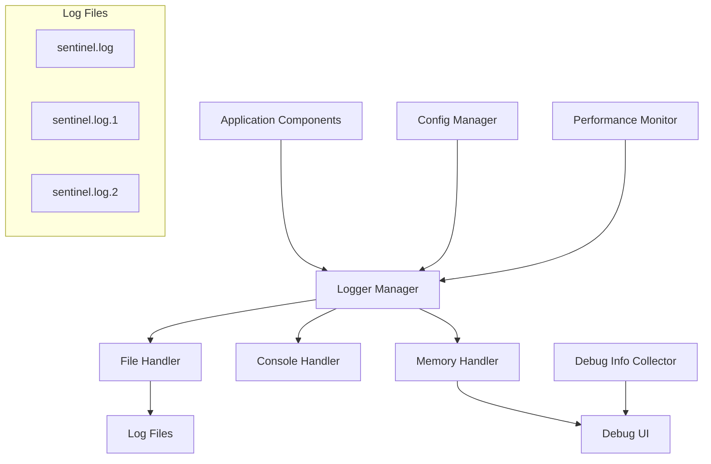

# Design Document

## Overview

The logging and debug system will be implemented as a centralized logging infrastructure that integrates with all existing Sentinel components. The design follows Python's standard logging practices while adding application-specific features like UI integration, performance monitoring, and structured debug information.

## Architecture



## Components and Interfaces

### 1. Logger Manager (`app/logging/logger_manager.py`)

Central logging coordinator that manages all logging operations.

```python
class LoggerManager:
    def __init__(self, config: AppConfig)
    def get_logger(self, name: str) -> logging.Logger
    def set_log_level(self, level: str)
    def rotate_logs()
    def cleanup_old_logs()
    def get_recent_logs(self, count: int = 100) -> List[LogEntry]
```

### 2. Performance Monitor (`app/logging/performance_monitor.py`)

Tracks and logs performance metrics for different operations.

```python
class PerformanceMonitor:
    def start_operation(self, operation_name: str) -> str
    def end_operation(self, operation_id: str)
    def get_metrics(self) -> Dict[str, Any]
    def log_ai_request(self, duration: float, success: bool)
    def log_scan_operation(self, file_count: int, duration: float)
```

### 3. Debug Info Collector (`app/logging/debug_collector.py`)

Gathers system information and application state for debugging.

```python
class DebugInfoCollector:
    def collect_system_info() -> Dict[str, Any]
    def collect_app_state() -> Dict[str, Any]
    def test_ai_connectivity() -> Dict[str, Any]
    def test_database_connectivity() -> Dict[str, Any]
    def generate_debug_report() -> str
```

### 4. Debug UI Components (`app/ui/debug_dialog.py`)

User interface for accessing debug information and logs.

```python
class DebugDialog(QDialog):
    def __init__(self, logger_manager: LoggerManager)
    def show_recent_logs()
    def show_system_status()
    def export_debug_info()
    def refresh_status()
```

## Data Models

### LogEntry Structure
```python
@dataclass
class LogEntry:
    timestamp: datetime
    level: str
    logger_name: str
    message: str
    module: str
    function: str
    line_number: int
    exception_info: Optional[str] = None
```

### Performance Metrics Structure
```python
@dataclass
class PerformanceMetrics:
    operation_name: str
    total_calls: int
    average_duration: float
    success_rate: float
    last_24h_calls: int
    errors: List[str]
```

## Error Handling

1. **Logging Failures**: If logging fails, fallback to console output and create emergency log files
2. **File Permission Issues**: Gracefully handle cases where log directory is not writable
3. **Disk Space**: Monitor available disk space and pause logging if critically low
4. **UI Errors**: Debug UI failures should not crash the main application

## Testing Strategy

### Unit Tests
- Test logger configuration and level changes
- Test log rotation and cleanup functionality
- Test performance monitoring accuracy
- Test debug info collection completeness

### Integration Tests
- Test logging integration with AI inference engine
- Test logging integration with database operations
- Test logging integration with file scanning
- Test UI debug dialog functionality

### Performance Tests
- Measure logging overhead on application performance
- Test log file I/O performance under load
- Verify memory usage of in-memory log buffer

## Configuration

### Log Configuration in `config.yaml`
```yaml
logging:
  level: INFO  # DEBUG, INFO, WARNING, ERROR, CRITICAL
  file_path: logs/sentinel.log
  max_file_size_mb: 10
  max_files: 5
  cleanup_days: 30
  console_output: true
  performance_monitoring: true
```

### Environment Variables
- `SENTINEL_LOG_LEVEL`: Override config file log level
- `SENTINEL_DEBUG`: Enable debug mode with verbose logging
- `SENTINEL_LOG_DIR`: Override default log directory

## Implementation Notes

1. **Thread Safety**: All logging operations must be thread-safe for PyQt6 compatibility
2. **Performance**: Logging should add minimal overhead to normal operations
3. **Structured Logging**: Use structured log formats for easier parsing and analysis
4. **Integration Points**: Add logging calls to existing components without breaking functionality
5. **Backward Compatibility**: Ensure existing functionality continues to work during logging integration